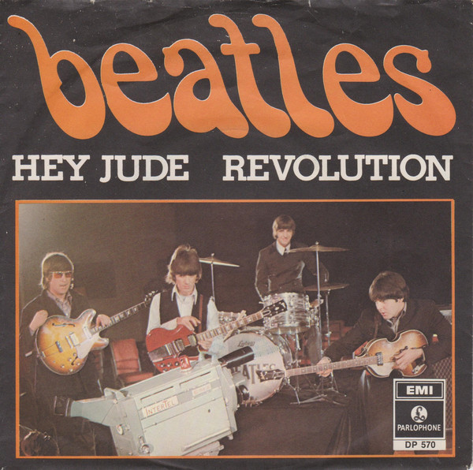
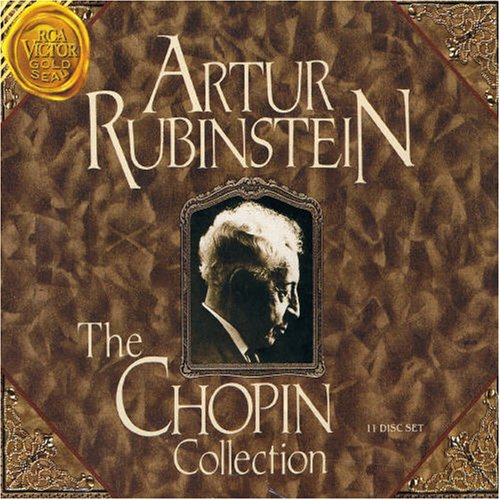
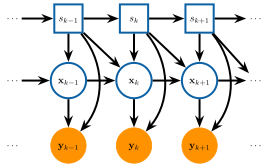

```{r setup, include=FALSE}
library(tidyverse)
library(lubridate)
library(fontawesome)
options(htmltools.dir.version = FALSE)
knitr::opts_chunk$set(
  dev = "svg",
  fig.path = "gfx/",
  fig.align = 'center',
  fig.width=9, fig.height=3.5, fig.retina=3,
  fig.showtext = TRUE,
  out.width = "100%",
  cache = TRUE,
  autodep = TRUE,
  echo = FALSE,
  message = FALSE, 
  warning = FALSE,
  hiline = TRUE
)
```

```{r xaringan-themer, include=FALSE, warning=FALSE}
library(xaringanthemer)
primary = "#002145"
secondary = "#6495ed"
tertiary = "#ffa319"
fourth_color = "#DB0B5B"

style_duo_accent(
  primary_color      = primary,  #"#002145", # UBC primary
  secondary_color    = secondary,  #"6EC4E8", # UBC secondary 4
  header_font_google = google_font("EB Garamond"),
  text_font_google = google_font("Open Sans"),
  code_font_google = google_font("Fira Mono"),
  text_color = primary,
  table_row_even_background_color = lighten_color(primary, 0.8),
  colors = c(
    tertiary = tertiary, fourth_color = fourth_color,
    light_pri = lighten_color(primary, 0.8),
    light_sec = lighten_color(secondary, 0.8),
    light_ter = lighten_color(tertiary, 0.8),
    light_fou = lighten_color(fourth_color, 0.8)
    ),
  outfile = here::here("src/xaringan-themer.css")
)
# theme_set(theme_xaringan())
```

```{r cover, include=FALSE, fig.width = 16, fig.height = 4}
library(dpf)
data(tempos)
load(here::here("src", "mazurkaResults.Rdata"))
pvec_ml = pvec_ml %>% 
  select(-value,-fevals,-gevals,-convergence) %>%
  data.matrix %>% data.frame
source(here::here("src", "dirichlet_precision.R"))
cols <- RColorBrewer::brewer.pal(9, "PRGn")
tempos %>% select(-meas_num,-beat) %>%
  pivot_longer(-note_onset) %>%
  ggplot() + 
  geom_rect(data=data.frame(xmin = 33, xmax = 45, ymin = -Inf, ymax = Inf),
            aes(xmin=xmin,xmax=xmax,ymin=ymin,ymax=ymax),
            fill = lighten_color(primary, .5)) +
  geom_line(aes(y=value, x=note_onset, color=name)) +
  scale_x_continuous(expand = expansion()) +
  scale_y_continuous(expand = expansion()) +
  theme_void() +
  scale_color_manual(values = rep(cols, length.out = nrow(tempos))) +
  theme(legend.position = "none", plot.background = element_rect(fill = primary))
```

layout: true

<div class="my-footer"><span><a href="https://dajmcdon.github.io/chopin-talk" style="color:white">dajmcdon.github.io/chopin-cmstats</a></span></div> 

---
background-image: url("gfx/cover-1.svg")
background-size: contain
background-position: top

<br/><br/><br/><br/><br/><br/><br/><br/><br/><br/>


.center[# Markov-switching state space models for uncovering musical interpretation]


.pull-left[
###Daniel J. McDonald
###University of British Columbia
####CMStatistics &mdash; 20 December 2021
]

.pull-right[.center[.middle[
<table>
<tr>
<td></td>
<td></td>
<td></td>
</tr>
<tr>
<td>`r fa("file-alt")` Paper</td>
<td>`r fa("chalkboard-teacher")` Slides</td>
<td>`r fa("at")` My WWW</td>
</tr>
</table>
]]]

???


---

## Musical taste

* Easy to describe music you like:
  - "Jazzy sound"
  - "Strong beat"
  - "good lyrics"
  - "anything by Taylor Swift"
  
* Harder to describe a .tertiary[performance]

* Classical music is mainly about performances of the .tertiary[same] music

* How do we think about which ones we like?

---

## Primer on "classical" music

* Written between 6th century and today

* Includes music written during the Classical period (1750&ndash;1820)

<blockquote cite="Leonard Bernstein">The real difference is that when a composer writes a piece of what’s usually called classical music, he puts down the exact notes that he wants, the exact instruments or voices that he wants to play or sing those notes—even the exact number of instruments or voices; and he also writes down as many directions as he can think of. </blockquote>

* Generally much more "musically" complicated

.center[]

???

* Musically complicated = wider range of chords, keys, instrumentation, contrasts

* Hey Jude: 3 chords (2 others briefly) in 7 minutes. Same key the whole time.

* For today, Chopin is running example

* Chopin: 6 unique chords in first 10 seconds. Two key areas in 1.5 minutes of music.


---

class: middle

.pull-left[

]

.pull-right[

]


???

Which one do you like better?

---

## What's different?

1. Mistakes

2. Extraneous noise

3. Recording quality

4. Articulation / Legato / Bowing / Breathing

5. Dynamics

6. Tempo / Rubato

???

The first three are uninteresting.

The others are about .red[.bold[interpretation]]

We like performances with "better" interpretations

---
class: inverse, middle, center
background-image: url("https://www.worldpianonews.com/wp-content/uploads/2020/05/Bosendorfer-280VC-custom4_Post-scaled.jpg")
background-size: cover


???

Piano music

* Simplifies the problem
  - No bowing, fingering, breathing, glissando
  
* Focus on __tempo__ 


---

```{r more-set-up, echo=FALSE, message=FALSE, warning=FALSE}
library(knitr)
library(splines)
library(gplots)
library(heatmaply)
library(RColorBrewer)
library(dendextend)
green = '#00884E'
blue = '#053B64'
orange = '#FF9200'
red = orange
db = "#053B64"
th = theme_bw(base_size = 18, base_family = "Times") +
  theme(axis.text=element_text(color = db),
        legend.title = element_blank(),
        legend.position = 'bottom',
        plot.title=element_text(color = db),
        strip.text = element_text(hjust=0,color=db),
        text = element_text(color = db))
#theme_set(theme_minimal(base_size=15,base_family="Times"))
data(tempos)
lt = diff(c(tempos$note.onset,61))
fivecolors = c('#7b3294','#c2a5cf','#a6dba0','#008837','#e7d4e8')
  #viridis(5, option='plasma',begin=.2)[c(1,4,2,5,3)] #brewer.pal(5,'Set1')[c(2,1,3,5,4)]
```

## Musical tempo

```{r rubinstein-tempo, fig.height=3}
ggplot(tempos, aes(x=note_onset, y=Rubinstein_1961)) +
  geom_line(color=red,size=3) + ylab('tempo (bpm)') + xlab('measure') +
  scale_x_continuous(breaks=1:4*2) +
  #geom_vline(xintercept = c(1,8.9,9)) +
  th +
  scale_y_continuous(expand = expansion(c(0,0.05)))+
  coord_cartesian(xlim=c(1,9),expand = FALSE) +
  geom_hline(yintercept = 132, linetype='dashed',size=2,color=db)
```

* Notes change "speed"

* Sometimes purposeful

* Speed is important for .red[.bold[interpretation]]

---
class: inverse, center, middle

# What is this "music"?


---

## Important musical terms

.pull-left-narrow[
### Notes

### Beat

### Measure

### Time signature

### Tempo

### Dynamics
]

.pull-right-wide[
All those little black dots  

Strongly felt impetus 

Collections of notes delimited by vertical "barlines" 

Number of beats / measure; type of note that gets the beat  

The prevailing speed, measured in bpm  

Loudness of the note
]


```{r score-bit, out.width="60%"}
include_graphics("gfx/ChopinFirst3.jpeg")
```

---

## Data

* CHARM Mazurka Project

```{r charm, out.width="60%"}
include_graphics("gfx/charm.png")
```

* Focus on timing only (dynamics also available)

* 50 recordings: Chopin Mazurka Op. 68 No. 3

* Recorded between 1931 and 2006

* 45 different performers

---
class: middle

```{r all-performance-lines, fig.height=5}
tempos %>% select(-meas_num,-beat) %>%
  pivot_longer(-note_onset) %>%
  ggplot() + 
  geom_rect(data=data.frame(xmin = 33, xmax = 45, ymin = -Inf, ymax = Inf),
            aes(xmin=xmin,xmax=xmax,ymin=ymin,ymax=ymax),
            fill = 'gray90', color = 'gray90') +
  geom_line(aes(y=value,x=note_onset,color=name)) + th +
  scale_y_continuous(expand = expansion(c(0,0.05)))+
  scale_x_continuous(expand = expansion()) +
  scale_color_manual(values = rep(fivecolors,length.out=nrow(pvec_ml))) +
  ylab("tempo (bpm)") + xlab("measure") + 
  theme(legend.position = "none")
```

---
class: middle

```{r all-perfs}
plots = vector("list", 4)
lt = diff(c(tempos$note_onset, 61))
for(i in 1:nrow(pvec_ml)){
  params = unlist(pvec_ml[i,])
  y = matrix(tempos[,gsub(' ','_',row.names(pvec_ml)[i])], nrow = 1)
  pmats = musicModel(lt, params[1], params[2:4], c(params[5],1,1),
                     params[6:12], c(132,0), c(400,10))
  beam = beamSearch(pmats$a0, pmats$P0, c(1,0,0,0,0,0,0,0,0,0), 
                    pmats$dt, pmats$ct, pmats$Tt, pmats$Zt,
                    pmats$HHt, pmats$GGt, y, pmats$transMat, 400)
  bestpath = beam$paths[which.max(beam$weights),]
  kal = kalman(pmats, bestpath, y)
  plots[[i]] = data.frame(measure = tempos$note_onset, tempo = c(y), 
                  inferred = c(kal$ests), state = convert11to4(bestpath))
}
plots = bind_rows(plots)
plots$performer = rep(row.names(pvec_ml), each=length(y))
plots$state = as.factor(plots$state) 
plots = plots %>% mutate(
  state=factor(state,labels=c('constant','decel','accel','stress'))
  )
perfcols = viridis_pal(begin=.2)(nlevels(plots$state))
#perfcols = c("#7b3294","#c2a5cf","#a6dba0","#008837")
# plots$pointx = 10
# plots$pointy = 400
# deunderscore = function(x) gsub('_',' ',x)
```

```{r example-perf,fig.height=6,fig.width=10}
perfshapes = c(20, 17, 18, 8)
plots = plots %>% mutate(performer, performer = sub('_',' ',performer))
ggplot(filter(plots, performer == 'Richter 1976')) + 
  geom_rect(data=data.frame(xmin = 33, xmax = 45, ymin = -Inf, ymax = Inf),
              aes(xmin=xmin,xmax=xmax,ymin=ymin,ymax=ymax),
              fill = 'gray90', color = 'gray90') +
  geom_line(aes(x=measure, y=tempo), color=primary) +
  scale_x_continuous(expand = expansion()) +
  geom_point(aes(x=measure, y=inferred, color=state,shape=state), size=4) +
 # scale_color_brewer(palette='Set1') +
  scale_color_brewer(palette = "PuOr", direction = -1) +
  scale_shape_manual(values=perfshapes) +
  th +
  facet_wrap(~performer)
```

---

## Chopin & Mazurkas

.pull-left[
#### Fryderyk Chopin (1810&ndash;1849)

* Born in Poland

* Moved to Paris at 21

* Virtuoso pianist

* Wrote mainly piano music
]

.pull-right[
#### Mazurka

* A Polish dance

* Chopin composed at least 58 for Piano

* Repetition is very important

* Certain rhythmic figures


]

???

Everything he wrote includes piano


---

background-image: url("gfx/entire-mazurka.jpg")
background-position: center
background-size: contain

???

Tempo markings, importantly, only 2 + rit and fermata

Dotted eighth sixteenth

ABA structure

Minor phrases

Repetition

Chord progression


---
class: center, middle, inverse

# Switching Kalman Filter


---

## Thinking about tempo

<br/>

.pull-left[
### 1. Playing in tempo

<br/>

### 2. Accelerando (speed up)

<br/>

### 3. Allargando (slow down)

<br/>

### 4. Tenuto (emphasis)
]

.pull-right[.center[

]]

---

## Transition diagram


.pull-left-wide[
```{r markov-trans, out.width="80%"}
include_graphics("gfx/markov-trans.svg")
```
]

.pull-right-narrow[

<h3 class=const>1. Constant tempo</h3>

<br/>

<h3 class=accel>2. Speeding up</h3>

<br/>

<h3 class=decel>3. Slowing down</h3>

<br/>

<h3 class=stress>4. Emphasis</h3>

]

---

## Intentions vs. observations

```{r ss-mod,out.width="80%"}

```

???

Musicians aren't perfect.

Observe noisy realization


---

## Inference

* Also unknown parameters $\theta$

<br/>

* If you know $\{S_k\}_{k=1}^n$ and $\theta$, Kalman filter gives $\{\hat{X}_k\}_{k=1}^n$

<br/>

* If you know $\{X_k\}_{k=1}^n$ and $\theta$, Viterbi algorithm gives $\{\hat{S}_k\}_{k=1}^n$

<br/>

* We need to learn $\{S_k,\ X_k\}_{k=1}^n$

<br/>

* And we need to estimate $\theta$

---


## Switching Kalman filter (for our model)


.pull-left[
$$
\begin{aligned}
X_{k+1} &= d(s_k,s_{k-1}) + T(s_k,s_{k-1}) X_k + \eta_{k+1}\\\\
Y_k &= c(s_k) + Z(s_k) X_k + \epsilon_{k}\\\\
\eta_{k} &\sim \textrm{N}(0, Q(s_k,s_{k-1}))\\\\
\epsilon_k & \sim \textrm{N}(0, G(s_k))
\end{aligned}
$$
]

.pull-right[
```{r ss-mod-again,out.width="1000%"}

```
]


---
## Examples


\begin{align}
  1\rightarrow 1 && 1\rightarrow 2\\
  x_{2} &= 
  \begin{pmatrix}1&0\\0&0\end{pmatrix} x_{1} 
        &   x_{3}
                    &= \begin{pmatrix} l_i\mu_{\textrm{acc}}\\ \mu_{\textrm{acc}}\end{pmatrix} +
  \begin{pmatrix}1&0\\0&0\end{pmatrix} x_{1} +
                         \mbox{N}\left(0,\ \sigma_{\textrm{acc}}^2\begin{pmatrix} l_i^2 & l_i\\ l_i & 1 \end{pmatrix}\right)\\
  y_2 &= (1\quad  0)  x_2 + \mbox{N}(0,\
                                 \sigma_\epsilon^2) &
y_3 &= (1\quad  0) x_3 + \mbox{N}(0,\
                                 \sigma_\epsilon^2).
\end{align}


<br>
--
<hr>
<br>

\begin{align}
  1\rightarrow 4 && 4\rightarrow 1\\
  x_{2} &= \begin{pmatrix}0 \\ \mu_{\textrm{stress}} \end{pmatrix} +
  \begin{pmatrix}1&0\\0&0\end{pmatrix} x_{1} + 
  \textrm{N}\left(0,\ \begin{pmatrix}0&0\\0&\sigma^2_{\textrm{stress}}\end{pmatrix}\right)
        &  x_{3} &= 
  \begin{pmatrix}1&0\\0&0\end{pmatrix} x_{2} \\
  y_2 &= (1\quad  1)  x_2 + \mbox{N}(0,\
                                 \sigma_\epsilon^2) &
y_3 &= (1\quad  0) x_3 + \mbox{N}(0,\
                                 \sigma_\epsilon^2).
\end{align}

???

x is dim-2 (speed, acceleration)

What is li?

---


## We don't know the discrete states

Pretend there are only 2 states

```{r s-tree, fig.align='center', fig.retina=3}
library(visNetwork)
library(widgetframe)
tnodes = tibble(id=1:15,group=c(1,2,2,3,3,3,3,4,4,4,4,4,4,4,4),label="", shape="square")
tedges = tibble(from=rep(1:7,each=2),to=c(2:15))
vn = visNetwork(tnodes,tedges) %>%
  visEdges(arrows = "to") %>%
  visOptions(highlightNearest = list(enabled=TRUE,degree=list(to=4,from=0),algorithm="hierarchical")) %>%
  visGroups(groupname='1',color=orange) %>% visGroups(groupname = '2',color=list(border=db, background=db)) %>% visGroups(groupname = '3',color=red) %>%
  visGroups(groupname = '4',color=green)%>%
  visHierarchicalLayout(direction = "UD")

frameWidget(vn, height=400)
```

.Large[_k_ = .dark-blue[1], .yellow[2], .red[3], .green[4]]

???

I have 4 states 

2nd order Markov

Leads to 11 states in 1-Markov

Piece has 231 notes


---

## Discrete particle filter &mdash; .green[`dpf()`]

1. Track at most $J$ paths through the $M^n$ tree

2. At time $k$, given $J$ paths, propogate each one forward

3. Sample the $JM$ possibilities to get only $J$

4. iterate forward through time until done

```{r small-tree, fig.align='center', fig.retina=3}
tnodes = tibble(id=4:15,group=c(3,3,3,3,4,4,4,4,4,4,4,4),label="", shape="square")
tedges = tibble(from=rep(4:7,each=2),to=c(8:15))
vn2 = visNetwork(tnodes,tedges) %>%
  visEdges(arrows = "to") %>%
  visOptions(highlightNearest = list(enabled=TRUE,degree=list(to=1,from=0),
                                     algorithm="hierarchical")) %>%
  visGroups(groupname = '3',color=red) %>%
  visGroups(groupname = '4',color=green)%>%
  visHierarchicalLayout()

frameWidget(vn2, height=200, width="100%")
```

???

This is a greedy approximation

The sampling step is important

Probability of sampling is proportional to current weight times likelihood times trans prob

---

## The complete algorithm

For each performance:

1. Guess a parameter vector $\theta$

2. .green[`dpf()`] gives greedy state sequence $\{\hat{S}_k\}_{k=1}^n$

3. It gives the likelihood as a side effect via .green[`kfilter()`]

4. Iterate 1&ndash;3 to maximize for $\theta \in \Theta$

5. Run the .green[`ksmoother()`] to get estimate for $\{X_k\}_{k=1}^n$

???

kfilter() 1 step appears in dpf()

ksmoother() is conditional on all the data


---

class: middle, center

```{r two-perfs, fig.height=5.25}
plots = plots %>% mutate(performer, performer = sub('_',' ',performer))
ggplot(filter(plots, performer %in% c('Richter 1976', 'Hatto 1993'))) + 
  geom_rect(data=data.frame(xmin = 33, xmax = 45, ymin = -Inf, ymax = Inf),
              aes(xmin=xmin,xmax=xmax,ymin=ymin,ymax=ymax),
              fill = 'gray90', color = 'gray90') +
  geom_line(aes(x=measure, y=tempo), color='gray40') +
  th +
  scale_x_continuous(expand = expansion()) +
  geom_point(aes(x=measure, y=inferred, color=state,shape=state),size=2) +
 # scale_color_brewer(palette='Set1') +
  scale_color_brewer(palette = "PuOr", direction = -1) +
  scale_shape_manual(values=15:18) +
  #theme(legend.position = 'bottom', legend.title = element_blank(),
  #      strip.text = element_text(hjust = 0))  +
  facet_wrap(~performer, ncol = 1)
```

---

class: middle, center, inverse

# Similar performances

---

## The estimated parameters

For each performance, we estimate $\theta$ by penalized maximum likelihood.

The parameters are things like:

  - average speed in different states
  - some variance parameters
  - transition probabilities
  
We have strong prior information.

???

Examples of strong priors

---

## Distance matrix on parameters

```{r clustering-processing}
perfs = tempos[,-c(1:3)] %>% as.matrix %>% t
row.names(pvec_ml) = sub('_',' ',row.names(pvec_ml))
hc_parm = pvec_ml %>% Dmats %>% Reduce(f='+')
row.names(hc_parm) = row.names(pvec_ml)
hc_perf = perfs %>% dist %>% percentize %>% hclust

dend_parm = hc_parm %>% as.dist %>% hclust %>% as.dendrogram
dend_perf = hc_perf %>% as.dendrogram
```

.pull-left[
* Use Mahalanobis
$$d(\theta,\theta') = \sqrt{(\theta-\theta')^\top V^{-1}(\theta-\theta')}$$

<br/>

* $V$ is prior covariance matrix

<br/>

* Incorporates correlations correctly on probability vectors

<br/>

* Some performances have no "close" neighbors
]

.pull-right[

```{r parametric-clusters,fig.width=5,fig.height=5, out.width="90%",fig.align='center'}
#hc_parm = hc_parm+diag(1e-12,nrow(hc_parm))
othercut = .35
subs = apply(hc_parm,1,quantile,probs=4/46) < othercut
sDmat = hc_parm[subs,subs]
nclusts = 4
colorthem = TRUE
heatmap.2(
  hc_parm, Rowv = dend_parm, Colv = dend_parm, 
  symm=TRUE,
  dendrogram = 'none',
  density.info = 'none', trace='none',
          #labRow = TRUE,
  labCol = NA, labRow = NA,
  key.title = NA,
  col= viridis,#colorRampPalette(c('#0b61a4','white')),
  key.xlab = NA, 
  margins = c(1,1),
  cexRow = 1,
  cexCol = .6,
  lhei=c(1,15),
  lwid=c(1,25),
  offsetCol = 0, offsetRow = 0,
  key=FALSE
)
```

]

---

```{r other-removed,fig.width=6, fig.height=5, fig.align='center',out.width="60%"}
sdends = sDmat %>% as.dist %>% hclust %>% as.dendrogram
if(colorthem) sdends = sdends %>% 
  set('labels_col', value=fivecolors[c(4,3,1,2)], k=nclusts) %>%
  set('branches_lty', 1) %>%
  set('branches_k_color', value=fivecolors[c(4,3,1,2)], k=nclusts)
heatmap.2(sDmat,
          Rowv = sdends, Colv = sdends,
          symm=TRUE,
          density.info = 'none', trace='none',
          #labRow = TRUE,
          labCol = NA,
          key.title = NA,
          col=viridis,#colorRampPalette(c('#0b61a4','white')),
          key.xlab = NA, 
          margins = c(1,8),
          cexRow = 1,
          cexCol = .6,
          lhei=c(2,8),
          lwid=c(2,8),
          offsetCol = 0, offsetRow = 0,
          key=FALSE
)

clustered = data.frame(clust = as.factor(cutree(as.hclust(sdends), k = nclusts)),
                 performer = row.names(sDmat))
pvec_all = pvec_ml %>% data.matrix %>% data.frame
pvec_all$performer = row.names(pvec_ml)
row.names(pvec_all) = NULL
pvec_all = full_join(pvec_all, clustered)
levels(pvec_all$clust) = c(levels(pvec_all$clust),'other')
pvec_all$clust[is.na(pvec_all$clust)] = 'other'
```

---

```{r clustered-parameters,fig.height=5.5}
lab_lookup = c("sigma[epsilon]^2", "mu[tempo]",
               "mu[acc]", "mu[stress]", "sigma[tempo]^2",
               "p[1*','*1]", "p[1*','*2]", "p[3*','*1]","p[1*','*3]",
               "p[2*','*1]","p[3*','*2]","p[2*','*2]")

ttt = pvec_all %>% gather(key='parameter',value='value',-clust,-performer)
ttt$parameter = factor(ttt$parameter,levels=unique(ttt$parameter),
                       labels= lab_lookup)
ttt %>%  ggplot(aes(x=value,fill=clust)) +
  geom_density(alpha=.75,adjust=1.75) +
  facet_wrap(~parameter,scales='free',
             labeller = label_parsed) +
  scale_fill_manual(values=fivecolors) +
  th + 
  scale_x_continuous(breaks=scales::pretty_breaks(3), expand=expansion())+
  scale_y_continuous(expand = expansion(c(0,0.05)))+
  xlab('') +theme(legend.position = "right")
```

---

## Probability of "stress"

```{r clustered-p14, fig.height=5}
p14 = pvec_all %>% mutate(p14 = 1-p11-p12-p13) %>% select(p14,clust,performer)
p14 %>%  ggplot(aes(x=p14,fill=clust)) +
  geom_density(alpha=.75,adjust=1.75) +
  scale_fill_manual(values=fivecolors) +
  th + 
  scale_x_continuous(breaks=scales::pretty_breaks(3), expand=expansion())+
  scale_y_continuous(expand = expansion(c(0,0.05)))+
  xlab('') +theme(legend.position = "right")
```


---

```{r clust-1,fig.height=5.25}
lookup = pvec_all %>% select(performer,clust)
plots = plots %>% left_join(lookup)
ggplot(filter(plots, clust=='1')) + 
  geom_rect(data=data.frame(xmin = 33, xmax = 45, ymin = -Inf, ymax = Inf),
              aes(xmin=xmin,xmax=xmax,ymin=ymin,ymax=ymax),
              fill = 'gray90', color = 'gray90') +
  geom_line(aes(x=measure, y=tempo), color='gray40') +
  geom_point(aes(x=measure, y=inferred, color=state, shape=state),size=2) +
  # scale_color_brewer(palette='Set1') +
  scale_x_continuous(expand = expansion()) +
  scale_color_brewer(palette = "PuOr", direction = -1,drop=FALSE) +
  scale_shape_manual(values=perfshapes,drop=FALSE) +
  th + theme(legend.position = "right") + ggtitle("Cluster 1") +
  facet_wrap(~performer,ncol=3) #+
```

---
```{r clust-2,fig.height=5.25}
ggplot(filter(plots, clust=='2')) + 
  geom_rect(data=data.frame(xmin = 33, xmax = 45, ymin = -Inf, ymax = Inf),
              aes(xmin=xmin,xmax=xmax,ymin=ymin,ymax=ymax),
              fill = 'gray90', color = 'gray90') +
  geom_line(aes(x=measure, y=tempo), color='gray40') +
  geom_point(aes(x=measure, y=inferred, color=state, shape=state),size=2) +
  # scale_color_brewer(palette='Set1') +
  scale_color_brewer(palette = "PuOr", direction = -1,drop=FALSE) +
  scale_x_continuous(expand = expansion()) +
  scale_shape_manual(values=perfshapes) +
  th + theme(legend.position = "right") + ggtitle("Cluster 2") +
  facet_wrap(~performer,ncol=3) #+
```

---
```{r similar-perfs,fig.height=5.25}
similar = c('Wasowski 1980','Shebanova 2002','Luisada 1991','Milkina 1970')
similar = filter(plots, performer %in% similar) %>%
  mutate(cl = paste0(performer, ", cluster ",clust))
ggplot(similar) + 
  geom_rect(data=data.frame(xmin = 33, xmax = 45, ymin = -Inf, ymax = Inf),
              aes(xmin=xmin,xmax=xmax,ymin=ymin,ymax=ymax),
              fill = 'gray90', color = 'gray90') +
  geom_line(aes(x=measure, y=tempo), color='gray40') +
  geom_point(aes(x=measure, y=inferred, color=state,shape=state),size=2) +
  # scale_color_brewer(palette='Set1') +
  scale_x_continuous(expand = expansion()) +
  scale_color_brewer(palette = "PuOr", direction = -1,drop=FALSE) + th +
  theme(legend.position = "right") +
  facet_wrap(~cl,nrow=2) #+
```

---
```{r rubinstein-perfs, fig.height=5.25}
similar = c('Rubinstein 1939', 'Rubinstein 1952',
            'Rubinstein 1961','Rubinstein 1966')
similar = filter(plots, performer %in% similar) %>%
  mutate(cl = paste0(performer, ", cluster ",clust))

ggplot(similar) + 
  geom_rect(data=data.frame(xmin = 33, xmax = 45, ymin = -Inf, ymax = Inf),
              aes(xmin=xmin,xmax=xmax,ymin=ymin,ymax=ymax),
              fill = 'gray90', color = 'gray90') +
  geom_line(aes(x=measure, y=tempo), color='gray40') +
  geom_point(aes(x=measure, y=inferred, color=state,shape=state),size=2) +
  scale_x_continuous(expand = expansion()) +
  # scale_color_brewer(palette='Set1') +
  scale_color_brewer(palette = "PuOr", direction = -1,drop=FALSE) + th +
  theme(legend.position = "right") +
  facet_wrap(~cl,nrow=2) #+
```

---
class: middle

```{r cortot-performance, fig.height=5}
ggplot(filter(plots, performer == 'Cortot 1951')) + 
  geom_rect(data=data.frame(xmin = 33, xmax = 45, ymin = -Inf, ymax = Inf),
              aes(xmin=xmin,xmax=xmax,ymin=ymin,ymax=ymax),
              fill = 'gray90', color = 'gray90') +
  geom_line(aes(x=measure, y=tempo), color='gray40') +
  geom_point(aes(x=measure, y=inferred, color=state,shape=state),size=2) +
  # scale_color_brewer(palette='Set1') +
  scale_color_brewer(palette = "PuOr", direction = -1,drop=FALSE) +
  scale_x_continuous(expand = expansion()) +
  scale_shape_manual(values=perfshapes, drop=FALSE) +
  th + theme(legend.position = 'right')+
  facet_wrap(~performer) #+
  # geom_point(aes(x=pointx,y=pointy,color=clust),alpha=.5, size=5, shape=15) + 
  # scale_color_manual(values = fivecolors)
```

---


## In summary

* We develop a switching model for tempo decisions 

* We give an algorithm for performing likelihood inference

* We estimate our model using a large collection of recordings of the same composition

* We demonstrate how the model is able to recover performer intentions

* We use the learned representations to compare and contrast recordings 


---

## Collaborators, etc.

.pull-left[
<p style="text-align:center;">


</p>
<p style="text-align:center;">
</p>
]

.pull-right[
<iframe width="460" height="250" src="https://www.youtube.com/embed/W8RTpOe-AqA?start=68" frameborder="0" allow="accelerometer; autoplay; encrypted-media; gyroscope; picture-in-picture" allowfullscreen></iframe>
<p style="text-align:center;"></p>
]